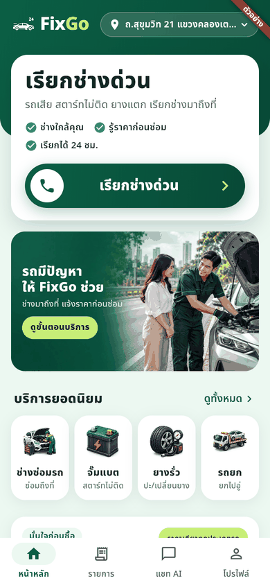
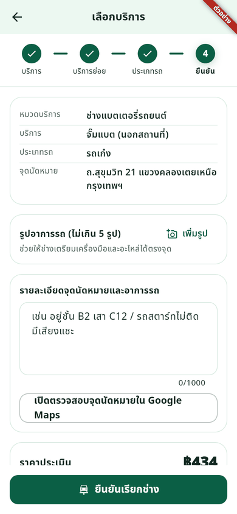
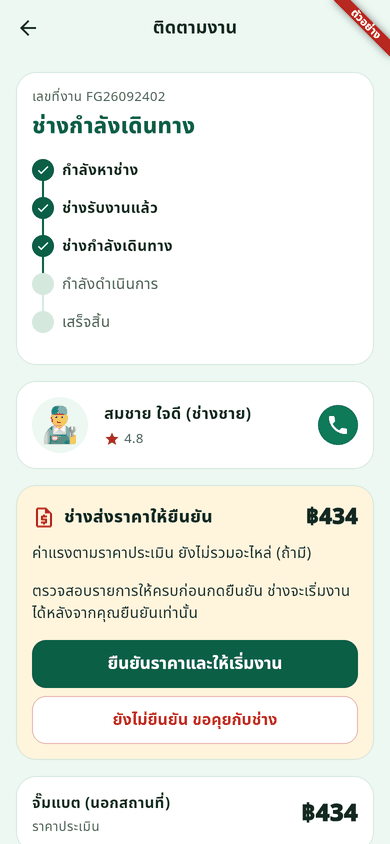
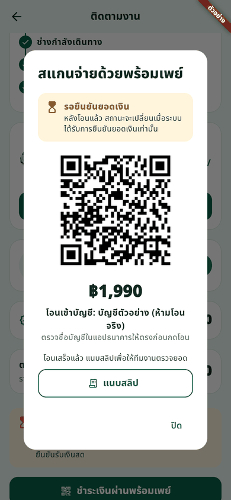
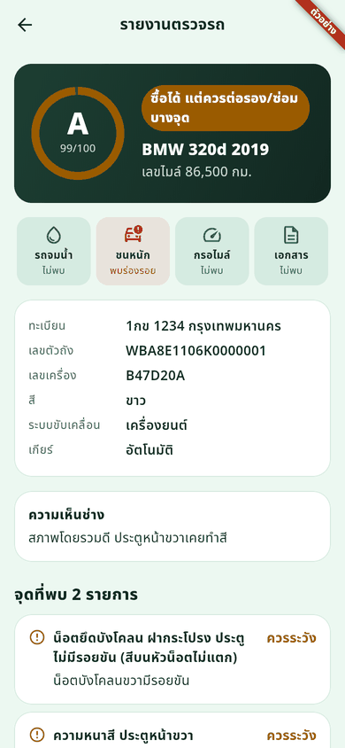
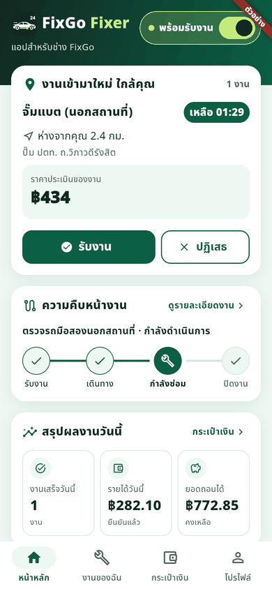
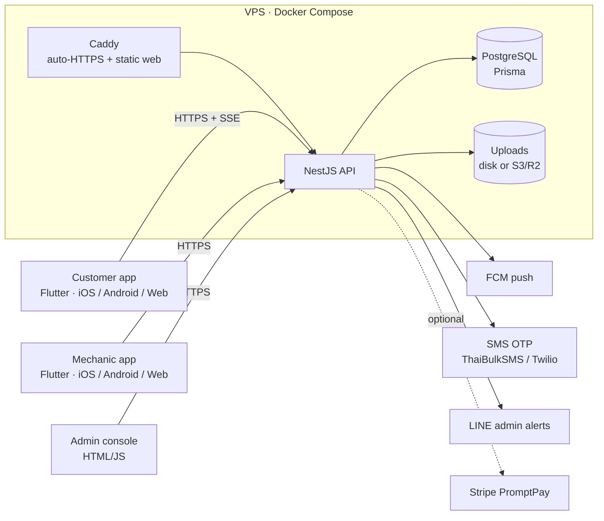

# FixGo — On-demand roadside car repair platform

**FixGo** connects drivers whose car breaks down with nearby mechanics in Thailand, like a ride-hailing app for car repair.
A customer requests help. The system offers the job to the closest available mechanics. The mechanic quotes a price, which the customer approves before any work starts. The customer then pays by cash or by Thai QR PromptPay.

The platform has three parts: a customer app, a mechanic app ("FixGo Fixer") and an admin console. All of it is built from one codebase and deployable with a single command.

[ภาษาไทยด้านล่าง](#ภาษาไทย)

| Home | Booking | Live tracking | PromptPay + slip | Used-car report | Mechanic app |
|:-:|:-:|:-:|:-:|:-:|:-:|
|  |  |  |  |  |  |

*Screenshots are from the interactive web demo, which uses sample data. That is why they carry a "ตัวอย่าง" (demo) ribbon.*

## Highlights

- **Dispatch engine.** It offers each job to the nearest online mechanics in batches of 4, with a 90-second accept window per batch, a 25 km radius and up to 12 candidates. The first mechanic to accept wins, and this is safe under concurrent accepts. If nobody accepts, an admin gets a LINE alert and can re-dispatch or cancel the job.
- **Price approval before work.** The mechanic proposes a quote, and the customer approves or rejects it. Every state transition is validated on the server.
- **Payments that can't be faked.**
  - Thai QR PromptPay payloads (EMVCo + CRC-16) go straight to the owner's account.
  - A customer can upload a slip, but an order becomes `PAID` only when an admin confirms the money arrived or a signed Stripe webhook confirms it. Displaying a QR or pressing a button never marks an order paid.
  - The wallet is an idempotent ledger. For cash jobs the mechanic keeps the cash and is charged the platform fee instead of being credited twice.
- **Real-time tracking** uses Server-Sent Events, falls back to polling, and sends push notifications through FCM HTTP v1 with a self-signed JWT.
- **Used-car inspection mode.** A 134-point checklist in 11 categories, with measured values (paint thickness, tread, brake pads, battery), required photo evidence, weighted A–E grading and red flags for flood, crash, odometer and paperwork problems.
- **Security and privacy (PDPA).**
  - OTP login is rate-limited.
  - Order ownership and role guards return 404 to strangers.
  - Upload URLs must be signed and are write-once. Files are checked by magic bytes and served with `nosniff` and a CSP.
  - Internal fields such as the commission rate are stripped from API responses.
  - Account deletion removes personal data and files.
  - Admin alerts contain no customer PII.
- **Production-ready ops.**
  - Docker (API, Postgres and Caddy with auto-HTTPS).
  - `deploy/install.sh` does a one-command install on a fresh Ubuntu VPS.
  - Nightly backups.
  - The API refuses to start with missing or placeholder secrets.
  - A trial mode lets the team test before SMS is paid for.
- **CI (GitHub Actions)** runs:
  - backend typecheck and tests (86 unit tests)
  - Flutter analyze and tests
  - a Docker boot test
  - a web image smoke test through the real Caddyfile
  - Android APK/AAB builds and an iOS build

## Architecture



| Layer | Tech |
|---|---|
| Mobile & web apps | Flutter 3 (Dart), shared `fixgo_core` package: theme, models, API client, location |
| Backend | NestJS 11, TypeScript, Prisma 5, PostgreSQL 16, RxJS (SSE) |
| Infrastructure | Docker, Caddy, GitHub Actions |
| Integrations | FCM, ThaiBulkSMS/Twilio, Stripe (optional), LINE Messaging API, OpenStreetMap Nominatim |

```text
backend/                NestJS + Prisma API
apps/customer/          Flutter customer app (mobile + web)
apps/provider/          Flutter mechanic app (mobile + web)
admin/                  Admin console
packages/fixgo_core/    Shared Flutter code
deploy/                 Docker Compose, Caddyfile, install & backup scripts
docs/                   Product spec, deploy, payments, push, build guides
```

## Run locally

```bash
# database
docker run --name fixgo-db -e POSTGRES_PASSWORD=postgres -p 5432:5432 -d postgres:16

# API
cd backend
cp .env.example .env
npm ci && npm run prisma:generate
npx prisma migrate deploy && npm run prisma:seed
npx ts-node prisma/create-admin.ts 0812345678 "Admin" '<a long password>'
npm run start:dev        # http://localhost:3000/api/health

# apps (web)
cd apps/customer         # or apps/provider
flutter run -d chrome --dart-define=API_BASE_URL=http://localhost:3000
```

In development, OTP codes are returned by the API, so no SMS account is needed.
Quality checks: `npm run typecheck && npm test` (backend), `flutter analyze && flutter test` (Flutter).

**Deploy to a VPS:** `sudo bash deploy/install.sh`. See [docs/DEPLOY.md](docs/DEPLOY.md).

---

## ภาษาไทย

**FixGo** แพลตฟอร์มเรียกช่างซ่อมรถฉุกเฉินนอกสถานที่ 24 ชม. ประกอบด้วย 3 ส่วน:
- **แอปลูกค้า:** เรียกช่าง ติดตามงานแบบเรียลไทม์ ยืนยันราคาก่อนซ่อม จ่ายเงินสดหรือพร้อมเพย์ และจองตรวจรถมือสอง 134 จุด
- **แอปช่าง FixGo Fixer:** รับงานตามระยะทาง เสนอราคา อัปเดตสถานะ ดูกระเป๋ารายได้ และทำรายงานตรวจรถพร้อมรูปหลักฐาน
- **หน้าแอดมิน:** อนุมัติช่าง ตรวจสลิปพร้อมเพย์ จัดการงานที่ไม่มีช่างรับ และจัดการคำขอเบิกเงิน

**จุดเด่นทางเทคนิค**
- ระบบจับคู่ช่างแบบส่งเป็นกลุ่มตามระยะทาง
- สถานะงานอัปเดตทันทีด้วย SSE
- สร้าง QR พร้อมเพย์มาตรฐาน EMVCo เอง เงินเข้าบัญชีเจ้าของโดยตรง
- สถานะ "ชำระแล้ว" ต้องผ่านการยืนยันจริงเท่านั้น
- บัญชีรายได้แบบ ledger ป้องกันการเครดิตซ้ำ
- รองรับ PDPA: ลบบัญชีแล้วลบข้อมูลและไฟล์ให้ด้วย
- ติดตั้งขึ้นเซิร์ฟเวอร์ได้ด้วยคำสั่งเดียว
- CI ตรวจทุก push

**สถานะ:** โค้ดพร้อมใช้งานและผ่านการทดสอบทั้งหมด กำลังเตรียมเซิร์ฟเวอร์เพื่อเปิดให้บริการจริง

เอกสารเพิ่มเติม:
- [การติดตั้ง](docs/DEPLOY.md)
- [ระบบชำระเงิน](docs/PAYMENTS.md)
- [การแจ้งเตือน](docs/PUSH.md)
- [การ build แอป](docs/BUILD.md)
- [สเปกผลิตภัณฑ์](docs/01-overview-and-personas.md)

## Attribution

- The main 3D service icons were made by the project owner.
- Lightning, siren and mechanic icons come from [Microsoft Fluent Emoji](https://github.com/microsoft/fluentui-emoji) (MIT). The license is in `packages/fixgo_core/assets/icons/licenses/`.
- Noto Sans Thai is used under the SIL Open Font License (`packages/fixgo_core/assets/fonts/OFL.txt`).
